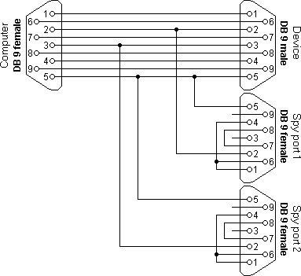

# Serial Sniffer

Sniffer serial traffics between two devices.

## Cable and Connection

RX/TX lines of the serial bus are connected perspectively to the two RX pins of
different serial devices on a PC.

A sample connection of cable: 

## Installation

```bash
$ npm install
```

## Usage

Linux:
```bash
./bin/serisnif --left /dev/ttyUSB0 --right /dev/ttyUSB1 -b 9600
```

Windows:
```bash
node ./src/serisnif.js --left /dev/ttyUSB0 --right /dev/ttyUSB1 -b 9600
```

Options:

- `-i --inter-frame-timeout`: inter-fame timeout time in ms
- `-l --left`: left side device
- `-r --right`: right side device
- `-h --help`: help
